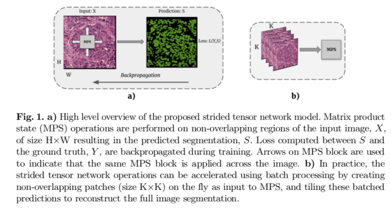

# README #

This is the official Pytorch implementation of 
"[Segmenting two-dimensional structures with strided tensor networks](https://arxiv.org/abs/2005.10052)", Raghavendra Selvan et al. 2021


### What is this repository for? ###

* Reproduce results on Lung CXR dataset reported in the paper
* v1.0

### How do I get set up? ###

* Basic Pytorch dependency
* Tested on Pytorch 1.6, Python 3.6 
* The preprocessed lungCXR data is provided as an archive. Unzip and point that as the data_dir.
* Train the model from scratch: 
python train.py --data data/lungCXR 


### Usage guidelines ###

* Kindly cite our publication if you use any part of the code
```
@inproceedings{raghav2021StridedTenet,
 	title={Segmenting two-dimensional structures with strided tensor networks},
	author={Raghavendra Selvan and Erik B. Dam and Jens Petersen},
	booktitle={27th international conference on Information Processing in Medical Imaging (IPMI)},
	month={Feb},
 	note={arXiv preprint arXiv:2020.2005.10052},
	year={2021}}
```

### Who do I talk to? ###

* raghav@di.ku.dk

